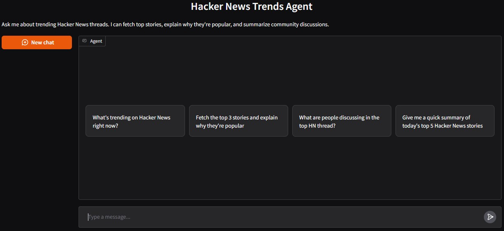

# Hacker News Agent

An AI agent built while learning from HuggingFace's Agents Course. It analyzes trending Hacker News discussions — fetches top threads, explains why they're popular, and extracts key insights from community comments.
<p align="center">
  
</p>
<p align="center"><em>HN Agent UI</em></p>

## What it does

- Fetch top HN stories with engagement metrics (score, comments, score/comment ratio)
- Extract and summarize top comments from any thread
- Answer follow-up questions about specific stories

## Getting Started

### Install dependencies

```bash
pip install -r requirements.txt
```

### Configure your LLM models

**Gemini (via LiteLLM):**
```bash
MODEL_PROVIDER=gemini
GEMINI_API_KEY=your_key_here
MODEL_ID=gemini/gemini-2.5-flash
```

**OpenAI:**
```bash
MODEL_PROVIDER=openai
OPENAI_API_KEY=your_key_here
MODEL_ID=gpt-4o-mini
```

**HuggingFace Inference:**
```bash
MODEL_PROVIDER=hf_inference
HF_TOKEN=your_token_here
MODEL_ID=Qwen/Qwen2.5-72B-Instruct
```

### Run

```bash
python scripts/run_gradio.py
```

Open http://localhost:7860 in your browser.

## How to Use

Just ask questions in natural language:

- "What's trending on Hacker News right now?"
- "Fetch the top 3 stories and explain why they're popular"
- "What are people discussing in the top HN thread?"
- "Give me a quick summary of today's top 5 stories"

The agent figures out which tools to call on its own. It fetches stories, analyzes engagement, and pulls comments as needed.

## How It Works

Built on the smolagents `CodeAgent`, which follows a **Thought -> Action -> Observation** loop. The agent reasons about your question, picks the right tool, reads the output, and formulates a response.

**Two tools:**
- **fetch_top_stories** — Gets top N stories from HN with metadata (story ID, title, score, comments, URL, engagement ratio)
- **extract_comment_insights** — Pulls top comments for a story by its numeric ID and identifies discussion themes

## Resources

- [smolagents Documentation](https://huggingface.co/docs/smolagents)

## License

MIT License
